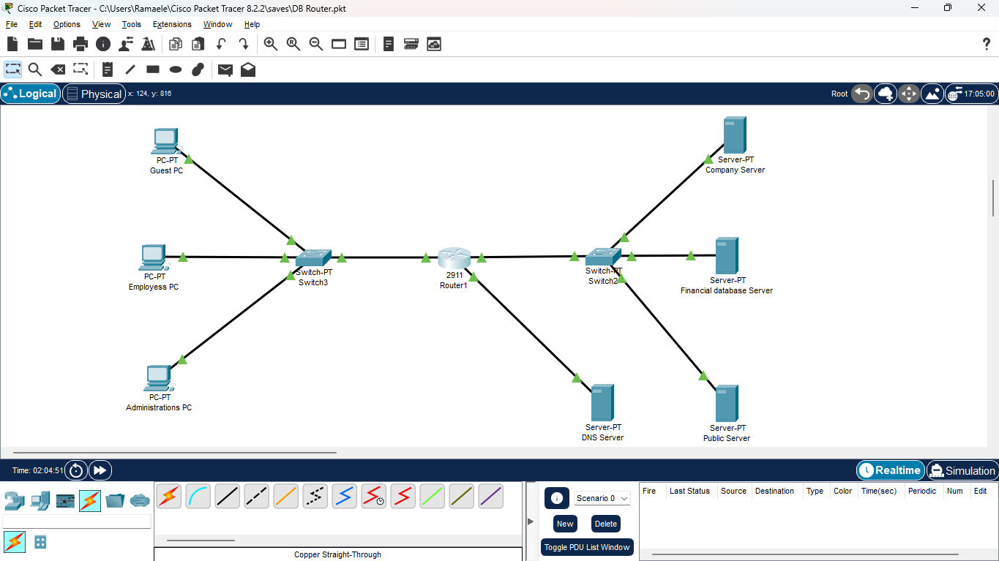

# 🛰️ SecureNet Infrastructure Lab

### A Cisco-Based DNS and Web Service Security Project

---

## 📖 Overview

**SecureNet Infrastructure Lab** is a Cisco Packet Tracer project designed to demonstrate a **secure, multi-server network infrastructure**.  
The project integrates **DNS services**, **web hosting**, and **client access** within a **secured routing and switching environment**.

It focuses on:
- DNS resolution between clients and servers  
- Web service hosting and accessibility  
- Secure configuration practices across network devices  

This lab simulates a realistic enterprise network, emphasizing **security**, **network reliability**, and **protocol configuration**.

---

## 🧩 Network Components

| Device Type | Role | Description |
|--------------|------|-------------|
| **DNS Server** | Central Name Resolution | Resolves domain names of all servers (e.g., Web Servers, APIs) |
| **Web Servers** | HTTP/HTTPS Hosts | Provide web pages and APIs to client PCs |
| **Router** | Core Routing Device | Connects multiple VLANs or networks, handles IP routing |
| **Switches** | Distribution & Access | Connects servers, clients, and routers securely |
| **PC Clients** | End Users | Access web services via DNS name resolution |

---

## 🔐 Security Focus

This project emphasizes **network security** at every level of the design.

| Security Mechanism | Description |
|--------------------|-------------|
| **DHCP Snooping** | Prevents unauthorized DHCP servers |
| **Dynamic ARP Inspection (DAI)** | Protects against ARP spoofing |
| **IP Proxy ARP** | Controlled IP forwarding for connected devices |
| **Trusted Interfaces** | Specific interfaces configured as trusted for ARP and DHCP traffic |
| **Proper DNS Role Isolation** | Only the DNS server resolves hostnames—other servers are not DNS-enabled |

---

## ⚙️ Configuration Summary

### **DNS Server**
- Configured with static DNS records for all web servers  
- Provides IP resolution for domain names used by client PCs  
- Does **not** forward or delegate other DNS zones  

### **Web Servers**
- Configured with HTTP services enabled  
- Linked to the DNS server via registered domain names  
- Serve web content and API responses to clients  

### **Router**
- Acts as a central gateway between VLANs or subnets  
- Each port has a unique IP address for routing  
- Can support multiple networks via sub-interfaces or multiport configuration  

### **Clients (PCs)**
- Receive IP configuration from DHCP (if implemented)  
- Use the DNS server’s IP for name resolution  
- Access web services using domain names (e.g., `http://webserver.local`)  

---

## 🧭 Topology Overview

**Network Flow Example:**
